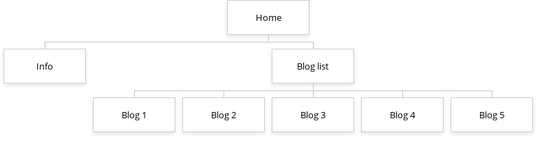

# T1A2: Portfolio

Jacob Smith

[Link to website github](https://github.com/intameli/T1A2-Portfolio)

## Site overview

### Purpose of site

This site was created to advertise myself to potential employers. It aims to showcase my abilities through my side projects, my personality through the blog, and provide details about my work experience.

### Target audience

The target audience is a potential software employer and as such the audience can be assumed to have technical knowledge relating to software.

### Site structure and features

The site will have 8 pages. As well as content, each page will have a header, footer and nav bar. The nav bar will contain three always visible links to the pages: home, info and blog list. The five other pages will be blog posts, and links to them will be shown in a drop-down menu when the mouse is hovered over the blog list link in the nav bar. Links to the individual blog posts will also be shown in the blog list page which is necessary for mobile users as hover doesn't work with touch devices.

Each blog post will contain an image gallery and a video as well as text. The image gallery will be images stacked on top of each other in a skeuomorphic style. left and right control buttons below will allow the user to cycle through which image is displayed on top.

The info page will have descriptions and links to my side projects. The info page will also have cards displayed in a grid that contain information about my experience. The home page will explain the site and provide links to my cv, github and linkedin.

responsive and accessible

<!-- explain the overall structure of your website and how different pages will be navigated -->

### Tech stack

It will be a static site with no backend. Html and css will be used to create the site. Additionally a small amout of javascript will be required to make the image gallery work.

## Components

<!-- explain how components and styling will engage the audience -->

- header (graphical)
- footer (text)
- nav (text)
- home content (graphical/text)
- links (text)
- info content (text)
- experience card (graphical/text)
- blog posts list (text)
- blog post (graphical/text)
- image gallery (graphical)

## Pages breakdown

<!-- explain your decision making process relating to the overall aesthetic of your website -->

### Overall design choices

Black text on a white background is the easiest to read so I decided on a light theme for my website. Similarly, I chose the Roboto font as it is easy to read. The nav bar went through several design iterations. It wasn't until I added A line below the nav bar that I realised having the drop-down menu form out of that line would look nice. Overall I went for a less is more aproach to the design of the site, generally trying to keep it simple.

### Home

I decided to add an image to this page to make the site look less bare. A mern stack image seemed appropriate considering the target audience of potenial software employers. To make this page responsive I switch from a one column layout to a two column layout at 600px. The left column with the text takes up most of the space at 1.5fr, with the image at 1fr. I made this decision as the text is more importand and the image is largly decorative. A tablet layout was not required on this page as it is fairly simple so it looks normal at tablet sizes.

#### Mobile

#### Desktop

### Info

The info page requires three layouts to look good at all screen sizes. A one column for mobile. At tablet sizes the content sits on top of the experience cards in a two column layout. And at desktop sizes there are three columns, one for the content and two for the cards. I added a small image to represent each card as I felt it gave the page more personality.

#### Mobile

#### Tablet

#### Desktop

### Blog list

I decided to keep the blog list page very simple. Just one layout for all sizes. I thought this page should be utilitarian.

### Blog post

At the desktop size I reused the two column layout(1.5fr 1fr) from the home page as I liked the look of the text taking up more space than the video. As I wanted the gallery images to be as wide as possible I placed it below taking up two columns. At mobile the text is stacked on top of the gallery and the video is not displayed so that the site loads fast on mobile. The buttons for moving between the gallery images are large so that they are easy to click on mobile.

#### Mobile

#### Desktop

